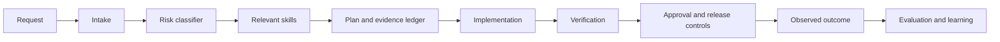

# AegisForge architecture

AegisForge is intentionally split into a portable instruction layer and a deterministic tooling layer. The instruction layer is consumed by compatible coding agents. The tooling layer validates contracts, classifies risk, and supports repeatable evaluation without requiring a particular model vendor.

## Components

| Component | Responsibility | Design constraint |
|---|---|---|
| `AGENTS.md` | Session bootstrap and behavioral guardrails | Portable, concise, no vendor-specific assumptions |
| `skills/` | Progressive-disclosure task guidance | Small, triggerable, evidence-oriented, independently reviewable |
| `schemas/` | Machine-readable contracts | Stable enough for tooling and adapters |
| `aegisforge/` | Reference deterministic CLI and policy engine | Explainable, dependency-light, testable |
| `templates/` | Human- and agent-facing evidence artifacts | Consistent outputs without hiding uncertainty |
| `docs/` | Architecture, governance, evaluation, and contributor guidance | Explain intent and boundaries, not duplicated skill text |
| `.github/` | CI and contribution automation | Least privilege and reproducible checks |

## Data flow

A request enters through the host harness and is first interpreted by `task-intake`. `risk-assessment` classifies the task and selects a workflow. The chosen skill family generates plans, controls, tests, and evidence. The deterministic CLI can validate repository contracts and provide a transparent first-pass assessment. Independent review and human approval remain outside the classifier’s authority.

## Policy boundary

The policy engine is deliberately conservative but incomplete. It detects common textual signals; it does not understand all domain context, infer permission, or guarantee safety. A high-risk assessment should trigger stronger controls, while a low-risk assessment must never override a human’s knowledge of a hidden risk.

## Extension points

Future adapters can expose the same workflow through native skills, plugins, hooks, context files, MCP tools, or CLI wrappers. Adapters should map tools and lifecycle events without changing the underlying safety contract. Every adapter must pass a clean-session acceptance test proving that the bootstrap loads before implementation begins.

Future evaluators can consume the evidence ledger and task-assessment schema to compare models, workflows, or releases. Evaluators must preserve the baseline and report uncertainty rather than optimizing for a single headline score.
